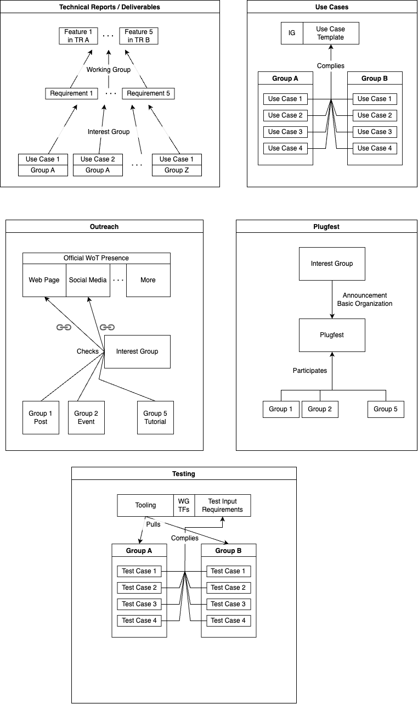

# [DRAFT] Relationship among WoT Groups

This document explains how different WoT groups within W3C can/should be linked to each other.

- WoT Working Group (WG): Responsible for writing normative and informative W3C Technical Reports (TRs) which are the deliverables of the WG, as well as establishing liaisons with related SDOs.
- WoT Interest Group (IG): Responsible for doing official outreach, collecting use cases to extract requirements, and organizing plugfests.
- Related Community Groups (CGs): They can participate in the activities of the WG or IG through well-defined mechanisms in addition to their own activities. See below for more details.

There are relationships between those activities. E.g. use cases relate to TRs, outreach and plugfests relate to CGs who do outreach themselves. Per activity, a more detailed relationship is written below. 
An overview figure is also available, which will be split to each activity later on.

## Technical Report / Deliverable process

Involved Groups: WG, IG

The IG extracts requirements from the use cases and makes them ready for the WG. Thus, the requirements are IG resources. The WG decides whether those requirements are correct and are not already addressed. If not, a feature description to satisfy the requirement should be extracted. This feature description drives the TR work for the relevant Task Forces (TF) of the WG. It is up to the TF to decide whether that feature is prioritized.

**Note:** The figure in the beginning will be split based on the category and moved to the corresponding category.

## Use Case process

Involved Groups: IG, CGs

The IG prepares a template for all groups to use when they want to document a WoT-related use case. This template can be used by any W3C group or liaison to explain the use case. If a CG fills the use case template, it should be a document under that CG's ownership. The IG can use that use case to extract the requirements while contacting the stakeholders as necessary.

**Note:** The figure in the beginning will be split based on the category and moved to the corresponding category.

## Plugfest process

Involved Groups: IG, CGs

The IG decides that a Plugfest should take place. It contacts the related CGs and liaisons. Each group can organize the topics they want to focus on for that plugfest or IG can give specific topics of interest.

**Note:** The figure in the beginning will be split based on the category and moved to the corresponding category.

## Outreach process

Involved Groups: IG, CGs

IG maintains the official website and official social media accounts. It can incorporate content from other groups by linking (or a similar procedure) to them.

**Note:** The figure in the beginning will be split based on the category and moved to the corresponding category.

## Testing process

Involved Groups: WG, IG, CGs

TFs that are responsible for a REC-track document, need test inputs to cover the features. The TF defines the testing procedure and participants of IG and CGs can contribute to their group's repository while complying with the rules of the TF.

**Note:** The figure in the beginning will be split based on the category and moved to the corresponding category.

Notes:
- WebAssembly WG says that contribution requires participation in the CG first.
- Test cases: Should we say that all input should go to one CG (WoT CG?) first?
